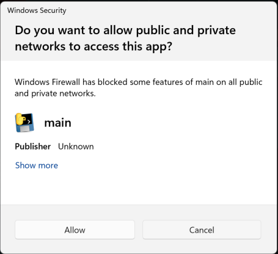

# UnityAssist
## Agentic UI Generator for Unity (MVP Beta)
Turn natural language into working Unity UI Toolkit screens. Describe the UI, get UXML + USS + C# bindings ready to run in-editor.

- Input: a short prompt (e.g., “Settings menu with Audio, Graphics, Controls; Save/Cancel buttons”)
- Output: UXML layout, USS styles, and a C# view/controller script.

## Install
1. Download
 - Get the UnityAssist.zip from the [releases page](https://github.com/LiberateGames/liberate-unity/releases).

2. Import
 - In Unity, unzip your UnityAssist.zip under the Assets folder.

3. Open the window
 - Window > UnityKnowLang > AI Chat Interface

4. Start UI generation
 - Describe your UI in natural language and generate!

> Note: You may see a security popup asking for internet access. This is expected - UnityAssist uses a Python backend to leverage battle-tested AI libraries and frameworks. Please allow access for the local backend executable to function properly.

